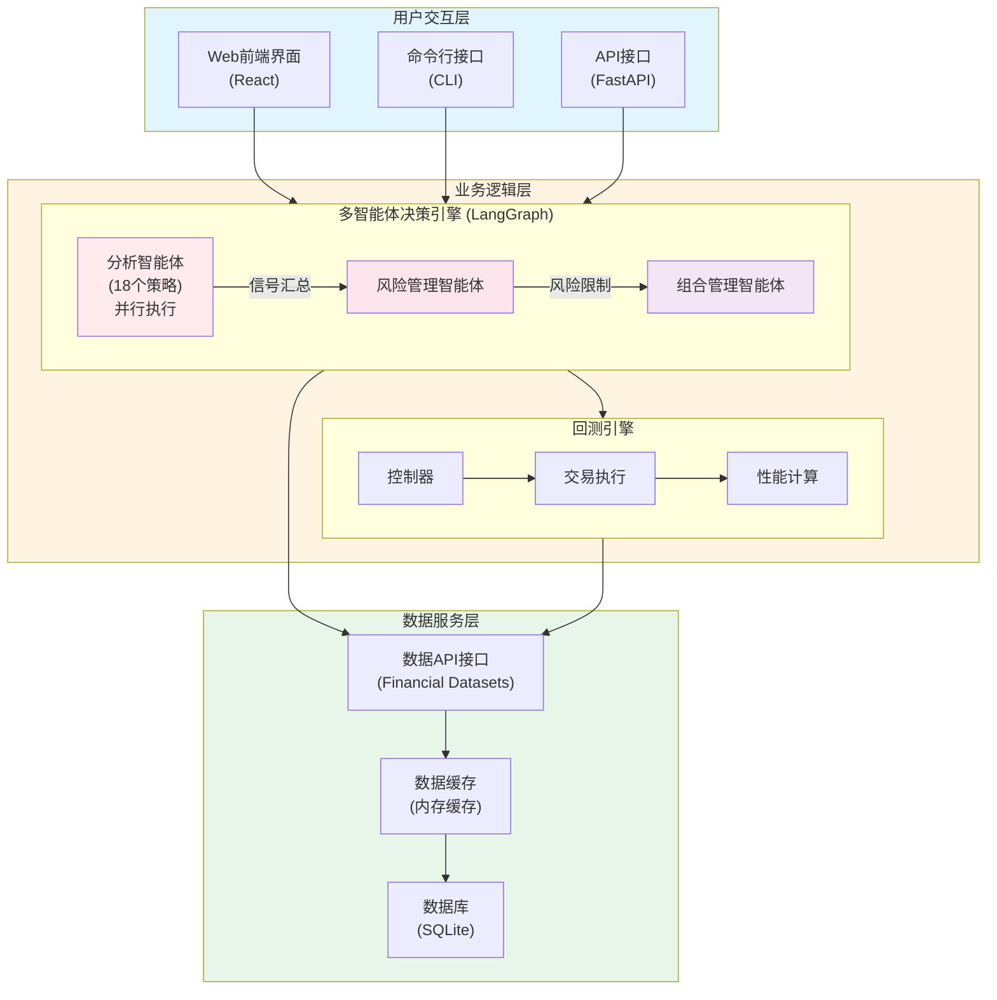

# AI Hedge Fund 项目调研报告

> 基于代码深度分析和文档研读的完整技术调研

---

## 一、核心结论

### 项目是啥？（一句话说清）

**AI Hedge Fund 是一个基于18个AI智能体协作的股票投资决策系统，通过LangGraph工作流编排多智能体并行分析股票数据，生成投资建议并支持历史回测，主要用于教育和研究目的，不进行真实交易。**

### 核心亮点是啥？

1. **多智能体协作架构**：18个专业投资策略智能体，覆盖价值投资、成长投资、量化分析等全谱系，实现真正的"集思广益"
2. **LangGraph工作流引擎**：基于状态机的优雅设计，支持并行执行和自动状态合并，架构清晰可扩展
3. **完整的回测系统**：时间序列模拟、真实交易执行逻辑、全面的性能指标计算（Sharpe、Sortino、最大回撤等）
4. **风险优先设计**：独立的风险管理智能体，基于波动率和相关性动态调整仓位限制
5. **市场无关架构**：核心逻辑与市场类型解耦，易于适配A股、港股等其他市场
6. **完善的文档体系**：6份详细技术文档，覆盖数据层、智能体层、工作流层、回测层等全栈

---

## 二、产品剖析

### 产品内核是啥？

#### 1. 多智能体决策引擎

**核心机制**：18个AI智能体代表不同的投资理念，每个智能体独立分析股票，生成投资信号（买入/卖出/持有/做空 + 置信度），最终由投资组合管理智能体整合所有信号，生成最终交易决策。

**智能体分类**：

| 类别 | 智能体 | 投资理念 |
|------|--------|---------|
| **价值投资** | Warren Buffett | 寻找优质公司，长期持有 |
| | Ben Graham | 安全边际，深度价值 |
| | Charlie Munger | 优质企业，合理价格 |
| | Michael Burry | 反向投资，深度价值 |
| | Mohnish Pabrai | 低风险高回报 |
| **成长投资** | Cathie Wood | 颠覆性创新，高增长 |
| | Peter Lynch | 买你了解的公司 |
| | Phil Fisher | 深度研究，长期增长 |
| **宏观策略** | Stanley Druckenmiller | 宏观趋势，不对称机会 |
| | Bill Ackman | 激进投资，推动变革 |
| | Rakesh Jhunjhunwala | 新兴市场，高增长 |
| **量化分析** | Aswath Damodaran | 估值分析，内在价值 |
| | Valuation Agent | 多种估值模型 |
| | Fundamentals Agent | 基本面分析 |
| | Technicals Agent | 技术分析 |
| | Sentiment Agent | 市场情绪分析 |
| | News Sentiment Agent | 新闻情感分析 |
| | Growth Agent | 增长分析 |
| **风险管理** | Risk Manager | 风险控制，仓位限制 |
| | Portfolio Manager | 最终决策，生成订单 |

#### 2. 工作流编排系统

**执行流程**：
```
开始节点
  ↓
┌─────────────────────────────────┐
│  并行执行所有选定的分析智能体     │
│  (每个智能体独立分析股票)        │
└─────────────────────────────────┘
  ↓ (所有智能体完成)
┌─────────────────────────────────┐
│  风险管理智能体                  │
│  - 计算风险指标                  │
│  - 设置仓位限制                  │
│  - 评估市场风险                  │
└─────────────────────────────────┘
  ↓
┌─────────────────────────────────┐
│  投资组合管理智能体              │
│  - 整合所有分析信号              │
│  - 考虑风险限制                  │
│  - 生成最终交易决策              │
└─────────────────────────────────┘
  ↓
结束节点
```

**技术实现**：基于LangGraph状态机模型，支持并行执行和自动状态合并。

#### 3. 回测引擎

**核心功能**：
- **时间序列模拟**：逐日执行交易决策，模拟真实交易过程
- **交易执行**：支持买入/卖出/做空/平仓，计算成本基础和已实现收益
- **性能计算**：Sharpe比率、Sortino比率、最大回撤、多空比率等
- **基准对比**：与SPY等基准指数对比，评估超额收益

**数据流**：
```
数据预取（提前加载历史数据）
  ↓
逐日循环
  ├─ 获取当日价格
  ├─ 调用智能体生成决策
  ├─ 执行交易
  ├─ 计算组合价值
  └─ 更新性能指标
  ↓
计算最终指标
  ↓
返回结果
```

#### 4. 数据服务层

**数据源**：
- Financial Datasets API（主要数据源，支持美股）
- 免费数据：AAPL, GOOGL, MSFT, NVDA, TSLA（无需API密钥）

**数据类型**：
- 股票价格数据（OHLCV）
- 财务指标（PE、PB、ROE、ROA等）
- 财务报表项目（收入、净利润、自由现金流等）
- 内幕交易记录
- 公司新闻

**缓存机制**：
- 内存缓存，自动去重
- 减少API调用，提升性能（缓存命中时性能提升 ~500倍）

### 产品使用场景有哪些？

#### 场景1：投资策略学习与研究

**目标**：理解不同投资大师的思路和策略

**使用方式**：
1. 选择股票（如AAPL）
2. 运行分析，查看18个智能体的不同观点
3. 对比价值投资vs成长投资的差异
4. 学习风险管理如何影响决策

**价值**：
- 理解不同投资理念
- 学习多角度分析方法
- 掌握风险控制思路

#### 场景2：策略回测验证

**目标**：验证某个投资策略的历史表现

**使用方式**：
1. 选择时间范围（如2023年全年）
2. 选择股票池（如科技股：AAPL, MSFT, NVDA）
3. 选择特定智能体组合（如只选价值投资智能体）
4. 运行回测，查看表现

**价值**：
- 验证策略有效性
- 评估风险水平
- 与基准对比

#### 场景3：投资组合优化

**目标**：找到最佳股票组合和智能体配置

**使用方式**：
1. 测试不同股票组合
2. 测试不同智能体组合
3. 对比回测结果
4. 选择最优配置

**价值**：
- 提高Sharpe比率
- 降低最大回撤
- 提高超额收益

#### 场景4：市场事件研究

**目标**：分析特定市场事件对策略的影响

**使用方式**：
1. 选择事件发生的时间段
2. 运行回测，观察策略表现
3. 分析不同智能体的反应
4. 总结经验教训

**价值**：
- 理解市场波动对策略的影响
- 优化策略以适应不同市场环境

### 产品流程，如何工作的？

#### 完整工作流程

**步骤1：数据获取**
```
用户输入：股票代码（如AAPL, MSFT, NVDA）
  ↓
系统调用：Financial Datasets API
  ↓
获取数据：
  - 价格数据（最近1年）
  - 财务指标（最近10期）
  - 财务报表项目
  - 内幕交易（可选）
  - 公司新闻（可选）
  ↓
数据缓存：存储到内存缓存
```

**步骤2：多智能体分析**
```
18个分析智能体并行执行：
  ├─ Warren Buffett Agent
  │  └─ 分析：护城河、管理层、盈利能力
  │  └─ 输出：买入，置信度85%
  ├─ Cathie Wood Agent
  │  └─ 分析：技术创新、市场颠覆、TAM
  │  └─ 输出：持有，置信度60%
  ├─ Technicals Agent
  │  └─ 分析：图表模式、技术指标
  │  └─ 输出：卖出，置信度70%
  └─ ...（其他15个智能体）
  ↓
所有智能体完成，信号汇总
```

**步骤3：风险管理**
```
风险管理智能体：
  ├─ 计算波动率（60天滚动窗口）
  ├─ 计算相关性（股票间相关性矩阵）
  ├─ 根据波动率调整仓位限制
  ├─ 根据相关性进一步调整
  └─ 输出：每个股票的仓位限制
```

**步骤4：投资组合管理**
```
投资组合管理智能体：
  ├─ 整合所有分析信号
  ├─ 考虑风险限制
  ├─ 考虑现金和保证金
  ├─ 生成最终交易决策
  └─ 输出：{AAPL: {action: "buy", quantity: 100}, ...}
```

**步骤5：回测执行（如果运行回测）**
```
对每个交易日：
  ├─ 获取当日价格
  ├─ 调用智能体生成决策
  ├─ 执行交易（买入/卖出/做空/平仓）
  ├─ 计算投资组合价值
  └─ 更新性能指标
  ↓
计算最终指标：
  ├─ Sharpe比率
  ├─ Sortino比率
  ├─ 最大回撤
  └─ 与基准对比
```

#### 技术实现细节

**LLM集成**：
- 每个智能体使用LLM（如GPT-4）进行推理
- 提示词包含投资理念、财务数据、分析摘要
- LLM生成结构化输出（Pydantic模型）：信号类型、置信度、推理说明

**状态管理**：
- 使用AgentState（TypedDict）管理全局状态
- 支持自动合并（字典合并、消息累加）
- 所有智能体共享同一状态

**并行执行**：
- LangGraph支持真正的并行执行
- 所有分析智能体同时工作，互不干扰
- 总执行时间 ≈ 最慢智能体的时间

### 产品边界

#### 明确支持的功能

✅ **支持的功能**：
- 多智能体股票分析（美股）
- 历史数据回测
- 性能指标计算
- 风险管理
- Web界面可视化
- 命令行接口

#### 明确不支持的功能

❌ **不支持的功能**：
- **真实交易**：系统明确声明不连接真实交易账户，不进行真实交易
- **实时数据流**：当前只支持历史数据回测，不支持实时交易
- **A股市场**：主要支持美股，A股需要自行适配
- **交易成本**：回测中未考虑手续费、滑点等交易成本
- **策略优化**：没有自动参数优化功能
- **组合优化**：没有现代投资组合理论（MPT）优化

#### 产品定位

**定位**：**教育和研究工具**

- ✅ 用于学习投资策略
- ✅ 用于验证策略有效性
- ✅ 用于研究市场行为
- ❌ 不用于真实交易
- ❌ 不提供投资建议

**免责声明**：
- 项目仅用于教育和研究目的
- 不提供投资建议或保证
- 不承担任何财务损失责任
- 历史表现不代表未来结果

---

## 三、技术剖析

### 技术架构

#### 整体架构图



#### 技术栈

**后端技术栈**：
- **语言**：Python 3.11+
- **AI框架**：
  - LangChain 0.3.7（LLM抽象层）
  - LangGraph 0.2.56（工作流编排）
- **Web框架**：FastAPI 0.104.0
- **数据库**：
  - SQLite（开发环境）
  - SQLAlchemy 2.0.22（ORM）
  - Alembic（数据库迁移）
- **数据处理**：Pandas 2.1+, NumPy 1.24+
- **依赖管理**：Poetry

**前端技术栈**：
- **框架**：React 18+ with TypeScript
- **构建工具**：Vite
- **UI组件**：
  - shadcn/ui（基于Radix UI）
  - Tailwind CSS
- **状态管理**：React Context API
- **可视化**：React Flow（工作流可视化）

#### 核心模块设计

**1. 智能体模块**（`src/agents/`）
- 每个智能体遵循统一接口
- 数据获取 → 分析处理 → LLM推理 → 返回信号
- 支持动态选择和组合

**2. 工作流引擎**（`src/graph/`）
- 基于LangGraph状态机模型
- 支持并行执行和自动状态合并
- 灵活的工作流配置

**3. 回测引擎**（`src/backtesting/`）
- 时间序列模拟（逐日执行）
- 交易执行器（买入/卖出/做空/平仓）
- 投资组合管理（成本基础、已实现收益）
- 性能指标计算（Sharpe、Sortino、最大回撤）

**4. 数据层**（`src/tools/api.py`, `src/data/`）
- API封装（统一接口）
- 数据缓存（内存缓存，自动去重）
- 数据验证（Pydantic模型）

#### 数据库设计

**核心表**：
1. **hedge_fund_flows** - 工作流配置
   - 存储React Flow的节点、边、视口状态
   - 支持工作流模板

2. **hedge_fund_flow_runs** - 运行记录
   - 跟踪每次执行的配置和结果
   - 存储初始和最终投资组合状态

3. **hedge_fund_flow_run_cycles** - 分析周期
   - 记录每个分析周期的详细结果
   - 包含智能体信号、交易决策、性能指标

4. **api_keys** - API密钥管理
   - 安全存储各种服务的API密钥

### 技术亮点

#### 1. 多智能体协作架构 ⭐⭐⭐⭐⭐

**设计优势**：
- **策略多样性**：18个智能体覆盖全谱系投资理念
- **并行执行**：所有智能体同时工作，互不干扰
- **信号融合**：风险管理智能体整合所有信号，投资组合管理智能体生成最终决策
- **易于扩展**：添加新智能体只需遵循统一接口

**技术实现**：
- LangGraph支持真正的并行执行
- 状态自动合并（字典合并、消息累加）
- 统一的智能体接口和配置系统

#### 2. LangGraph工作流编排 ⭐⭐⭐⭐⭐

**设计优势**：
- **状态机模型**：清晰的状态流转和节点执行顺序
- **并行执行**：多个节点可以同时执行
- **自动状态合并**：使用Annotated类型和合并函数自动处理
- **可视化支持**：React Flow可视化工作流

**技术实现**：
```python
class AgentState(TypedDict):
    messages: Annotated[Sequence[BaseMessage], operator.add]  # 自动累加
    data: Annotated[dict[str, any], merge_dicts]              # 自动合并
    metadata: Annotated[dict[str, any], merge_dicts]          # 自动合并
```

#### 3. 完整的回测引擎 ⭐⭐⭐⭐⭐

**设计优势**：
- **真实模拟**：逐日执行，考虑真实交易逻辑
- **完整交易支持**：买入/卖出/做空/平仓，成本基础计算
- **全面性能指标**：Sharpe、Sortino、最大回撤、多空比率等
- **基准对比**：与SPY等基准指数对比

**技术实现**：
- 时间序列模拟（pandas date_range）
- 交易执行器（Portfolio类管理持仓和现金）
- 性能指标计算（PerformanceMetricsCalculator）

#### 4. 风险优先设计 ⭐⭐⭐⭐⭐

**设计优势**：
- **独立风险管理**：风险管理智能体在所有分析智能体之后运行
- **动态仓位限制**：基于波动率和相关性调整
- **约束驱动决策**：投资组合管理智能体必须遵守风险限制

**技术实现**：
- 波动率计算（60天滚动窗口）
- 相关性分析（股票间相关性矩阵）
- 仓位限制公式：
  ```
  基础限制 × 波动率调整 × 相关性调整 = 最终限制
  ```

#### 5. 数据缓存机制 ⭐⭐⭐⭐

**设计优势**：
- **性能提升**：缓存命中时性能提升 ~500倍
- **自动去重**：基于唯一键字段自动去重
- **减少API调用**：降低成本和速率限制风险

**技术实现**：
- 内存缓存（dict结构）
- 缓存键设计（基于参数组合）
- 自动合并机制（避免重复数据）

#### 6. 市场无关架构 ⭐⭐⭐⭐⭐

**设计优势**：
- **核心逻辑解耦**：智能体逻辑与市场类型无关
- **易于适配**：只需替换数据源和交易规则
- **可扩展性**：支持多市场（A股、港股等）

**技术实现**：
- 数据层抽象（统一API接口）
- 交易规则抽象（TradeExecutor可扩展）
- 智能体提示词可配置

#### 7. 完善的文档体系 ⭐⭐⭐⭐⭐

**文档完整性**：
- 6份详细技术文档
- 覆盖数据层、智能体层、工作流层、回测层
- 包含扩展指南和最佳实践

**文档质量**：
- 代码示例丰富
- 架构图清晰
- 概念解释详细

---

## 四、启示与总结

### 技术启示

#### 1. 多智能体协作的最佳实践

**启示**：
- **并行执行**：充分利用多核CPU和网络I/O，大幅提升效率
- **状态管理**：使用TypedDict和Annotated类型实现优雅的状态合并
- **信号融合**：通过独立的风险管理和组合管理智能体，实现信号的合理整合

**可借鉴**：
- 适用于需要多角度分析的场景（如投资决策、风险评估、产品评审等）
- LangGraph工作流编排模式可应用于其他多智能体系统

#### 2. 工作流编排的优雅设计

**启示**：
- **状态机模型**：清晰的状态流转，易于理解和调试
- **自动状态合并**：减少手动状态管理代码，降低出错概率
- **可视化支持**：React Flow可视化工作流，提升用户体验

**可借鉴**：
- LangGraph状态机模式适用于需要复杂工作流的场景
- 可视化工作流有助于用户理解系统执行过程

#### 3. 回测引擎的完整实现

**启示**：
- **真实模拟**：逐日执行，考虑真实交易逻辑，结果更可靠
- **完整交易支持**：支持多空交易，成本基础计算，已实现收益跟踪
- **全面性能指标**：Sharpe、Sortino、最大回撤等，多维度评估策略

**可借鉴**：
- 回测引擎设计模式可应用于其他需要历史验证的场景
- 性能指标计算方法可标准化为通用模块

#### 4. 风险优先的设计理念

**启示**：
- **独立风险管理**：风险管理作为独立环节，确保风险控制不被忽略
- **动态调整**：基于实时风险指标动态调整仓位限制
- **约束驱动**：决策必须在风险约束内，防止过度风险

**可借鉴**：
- 风险优先理念适用于所有涉及风险的系统
- 动态风险调整机制可应用于其他风险管理场景

### 业务启示

#### 1. 教育导向的产品定位

**启示**：
- **明确边界**：明确声明不进行真实交易，避免法律风险
- **学习价值**：通过多智能体协作，帮助用户理解不同投资理念
- **研究工具**：提供完整的回测功能，支持策略验证和研究

**可借鉴**：
- 教育导向的产品定位有助于降低法律风险
- 学习价值是产品的重要差异化优势

#### 2. 市场无关的架构设计

**启示**：
- **核心逻辑解耦**：智能体逻辑与市场类型无关，易于扩展
- **数据层抽象**：统一的数据接口，易于替换数据源
- **规则可配置**：交易规则可配置，支持不同市场

**可借鉴**：
- 市场无关设计适用于需要支持多市场的场景
- 数据层抽象是系统可扩展性的关键

### 对我们项目的价值

#### 1. 技术底座价值 ⭐⭐⭐⭐⭐

**可直接采用**：
- ✅ LangGraph工作流编排模式
- ✅ 多智能体协作架构
- ✅ 回测引擎核心逻辑
- ✅ 风险管理量化方法

**适用场景**：
- 需要多角度分析的决策系统
- 需要历史验证的策略系统
- 需要风险控制的投资系统

#### 2. 参考实现价值 ⭐⭐⭐⭐⭐

**可参考学习**：
- ✅ 18个投资策略智能体的提示词工程
- ✅ 数据缓存和API封装设计
- ✅ Web前端工作流可视化
- ✅ 性能指标计算标准化

**适用场景**：
- 开发AI+金融应用
- 构建多智能体系统
- 实现回测功能

#### 3. 学习价值 ⭐⭐⭐⭐⭐

**最佳实践学习**：
- ✅ AI+金融的完整应用案例
- ✅ 从数据获取到决策输出的全链路实现
- ✅ 代码质量高，注释详细，易于学习

**适用场景**：
- 团队技术培训
- 架构设计参考
- 代码实现学习

### 最终建议

#### 建议：参考 + 部分采用

**理由**：
- ✅ **架构设计优秀**：可直接参考工作流编排和智能体协作模式
- ✅ **回测引擎完整**：可直接采用或基于此扩展
- ✅ **代码质量高**：易于理解和二次开发
- ✅ **MIT许可证**：允许商用，只需保留版权声明
- ⚠️ **数据源限制**：当前主要支持美股，需适配A股数据源
- ⚠️ **功能缺失**：不连接真实交易，需自行实现实盘接口

#### 行动建议

**短期（1-2周）**：
1. 深入研究代码，理解架构设计
2. 提取核心设计模式（工作流编排、多智能体协作）
3. 运行示例，熟悉系统使用

**中期（1-2月）**：
1. 适配A股数据源（akshare/tushare）
2. 适配A股交易规则（涨跌停、T+1等）
3. 实现A股回测功能
4. 测试验证

**长期（3-6月）**：
1. 基于此架构开发自己的投资决策系统
2. 添加实盘交易接口
3. 添加策略优化功能
4. 性能优化和功能扩展

### 总结

AI Hedge Fund 是一个**设计精良、架构清晰、文档完善**的开源项目，具有很高的**技术价值**和**学习价值**。

**核心优势**：
- ✅ 多智能体协作架构（18个智能体）
- ✅ LangGraph工作流编排（优雅的状态管理）
- ✅ 完整的回测引擎（时间序列模拟）
- ✅ 风险优先设计（独立风险管理）
- ✅ 市场无关架构（易于适配A股）
- ✅ MIT许可证（允许商用）

**适用场景**：
- ✅ 投资策略研究和验证
- ✅ AI+金融应用学习
- ✅ 快速搭建投资决策系统原型
- ✅ A股量化投资系统开发

**关键启示**：
- 多智能体协作是解决复杂决策问题的有效方式
- 工作流编排的优雅设计值得学习
- 风险优先的设计理念适用于所有涉及风险的系统
- 市场无关的架构设计是系统可扩展性的关键

**最终评价**：这是一个**高质量的开源项目**，无论是作为技术底座、参考实现，还是学习案例，都具有很高的价值。建议深入研究，提取核心模式，适配A股市场，开发自己的投资决策系统。

---

**报告生成时间**：2025年  
**报告版本**：2.0  
**调研深度**：代码级深度分析 + 文档研读
